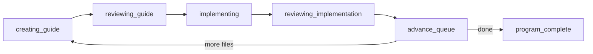

# Vibe Coding

State-driven agent templates and skills for **hands-off multi-phase programs**: numbered docs under a root → implementation guide → guide review → code implementation → final review — repeated automatically until done.

## Principles

- **State files are the contract** — durable markdown/YAML state, not chat memory.
- **Fresh agent per step** — each creator, reviewer, fixer, and implementer is a new context.
- **Router vs worker** — the program skill only copies state and triggers child flows; it never creates, reviews, or implements.
- **One trigger, full program** — process every remaining phase file in one run; stop only on `program_complete` or `hard_stop`.

## Layout

```
.cursor/
  agents/          # Subagent prompts + state files (*.md)
  skills/          # Orchestration skills (*/SKILL.md)
docs/plans/
  PLAN_TEMPLATE.md # Implementation guide structure (feature mode)
```

---

## Main workflow: `program-execution-workflow`

**Entry point.** Invoke once; router runs all remaining phases.

### Configure (user sets only)

```yaml
# program-workflow-state.md
doc_root: "docs/<program>/"
file_glob: "phase-*.md"
last_completed_index: -1      # 0-based; -1 = none done yet
pipeline_stage: creating_guide
guide_mode: refactor            # refactor | feature
```

No per-phase filename list. Router discovers sorted `phase-*.md` files and resumes at `last_completed_index + 1`.

### Outer loop

```text
WHILE pipeline_stage != program_complete AND hard_stop is null:
  run one phase (5 stages below)
  advance_queue → if more files: immediately start next phase (same session)
```

### One phase (router triggers child flows)

```text
creating_guide          → guide creator agent
reviewing_guide         → implementation-guide-review-loop
implementing            → feature-implementation-workflow
reviewing_implementation → implementation-review-loop (final)
advance_queue           → last_completed_index++; next file or program_complete
```



| Stage | Triggered | Router writes |
|-------|-----------|---------------|
| `creating_guide` | `refactor-guide-creator` or `implementation-guide-creator` | Creator input from **discovered phase file**; after creator, copy **output guide path** to guide-review states |
| `reviewing_guide` | `implementation-guide-review-loop` | — |
| `implementing` | `feature-implementation-workflow` | `implementation-state` after guide review `COMPLETE` |
| `reviewing_implementation` | `implementation-review-loop` | Final review seed |
| `advance_queue` | — | Bump index; clear guide fields; loop or exit |

### Path model

| Doc | Role |
|-----|------|
| Discovered `phase-*.md` at `current_index` | **Phase input** → guide creator (`refactor-guide-state.statement`) |
| Creator output (`refactor-guide-state.guide`) | **Implementation guide** → guide review + implementation |
| Program README under `doc_root` | Optional context — **not** the per-phase input doc |

### Triggers

| Command / phrase |
|----------------|
| `program-execution-workflow` |
| “run program workflow” |
| “process all remaining phases under [doc_root]” |

### Stop conditions (only)

| Condition | Meaning |
|-----------|---------|
| `pipeline_stage: program_complete` | All discovered files finished |
| `hard_stop` | Child flow: `NEEDS_CLARIFICATION` or `MAX_ROUNDS_REACHED` |
| `pipeline_stage: idle` | State not configured |

**Not a stop:** one phase finished, child skill “final response”, or `advance_queue` with more files remaining.

---

## Child flows (invoked by router)

### `implementation-guide-review-loop`

Guide document review only (not code).

```text
fresh implementation-guide-reviewer → fixer if blocked → fresh reviewer → COMPLETE
```

States: `implementation-guide-state.md`, `implementation-guide-review-state.md`

### `feature-implementation-workflow`

```text
feature-implementer (one task) → next task in phase
  → phase boundary: implementation-reviewer (current_phase) + fixer loop
  → until guide complete
```

States: `implementation-state.md`, `implementation-review-state.md`  
Reference: `IMPLEMENTATION_FLOW.md`

### `implementation-review-loop`

| Mode | When |
|------|------|
| `current_phase` | Phase gate during implementation |
| `final_implementation` | After all tasks done (program router uses this) |

States: `implementation-review-state.md`

---

## Agents in the pipeline

| Agent | Role |
|-------|------|
| `refactor-guide-creator` | Refactor implementation guide from phase input + program rules |
| `implementation-guide-creator` | Feature implementation guide from HLD + PLAN_TEMPLATE |
| `implementation-guide-reviewer` | Blocker-only guide review |
| `implementation-guide-fixer` | Guide fixes from review ledger |
| `feature-implementer` | One implementation task per run |
| `implementation-reviewer` | Code review against guide |
| `implementation-fixer` | Code fixes from review ledger |

---

## Skills

| Skill | Role |
|-------|------|
| `program-execution-workflow` | **Router** — multi-phase outer loop |
| `implementation-guide-review-loop` | Guide review/fix |
| `feature-implementation-workflow` | Implement + phase gates |
| `implementation-review-loop` | Code review/fix |

Handoff field maps: `.cursor/skills/program-execution-workflow/state-handoffs.md`  
Router reference: `.cursor/agents/PROGRAM_EXECUTION_FLOW.md`

---

## State files

### Router (minimal)

| File | You set | Router sets |
|------|---------|-------------|
| `program-workflow-state.md` | `doc_root`, `file_glob`, `last_completed_index`, `guide_mode`, `pipeline_stage` | `current_index`, `current_input_doc`, `current_guide`, `hard_stop` |

Example: `program-workflow-state.example.md`

### Child flows (agents own detail)

| File | Flow |
|------|------|
| `refactor-guide-state.md` | Guide creator (refactor) — `guide` = output path on completion |
| `implementation-guide-state.md` | Guide review scope |
| `implementation-guide-review-state.md` | Guide blocker ledger |
| `implementation-state.md` | Active guide, phase, task |
| `implementation-review-state.md` | Code blocker ledger |

Examples: `*.example.md`

---

## Quick start

1. Number phase docs under `doc_root` (e.g. `phase-00-….md`, `phase-01-….md`, …).
2. Copy `program-workflow-state.example.md` → `program-workflow-state.md`.
3. Set `doc_root`, `last_completed_index`, `pipeline_stage: creating_guide`, `guide_mode`.
4. Run **`program-execution-workflow`**.
5. Resume after interruption: same command — router reads `pipeline_stage` and `last_completed_index`.

---

## Standalone use (without program router)

| Goal | Skill |
|------|-------|
| Implement one guide manually | `feature-implementation-workflow` + `implementation-state.md` |
| Review one guide doc | `implementation-guide-review-loop` |
| Final code review only | `implementation-review-loop` (`final_implementation`) |

---

Open for use and customization. See each skill’s `SKILL.md` for triggers, handoffs, and hard rules.
